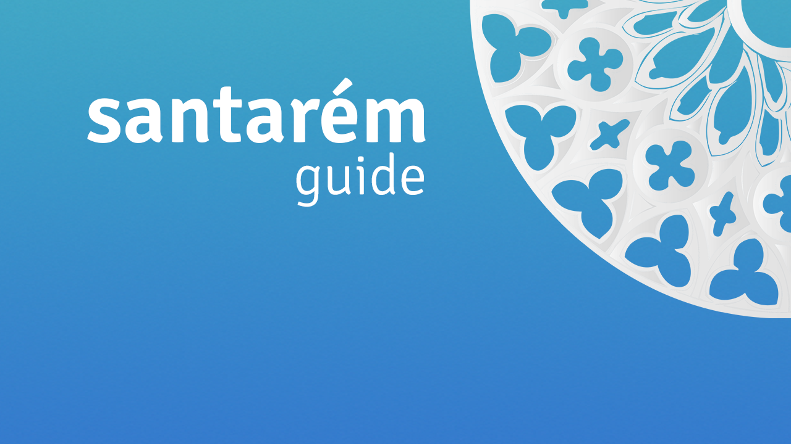
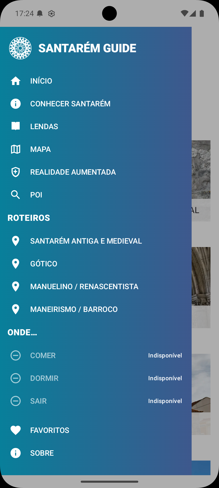

  

  <strong>Descobre Santarém, ao teu ritmo.</strong> 
  Roteiros, património, mapa e realidade aumentada numa aplicação Android.

  <a href="README.md">Português</a> · <a href="README.en.md">English</a>

# Santarém Guide

O **Santarém Guide** ajuda a explorar a cidade através de 37 locais organizados
em roteiros, com descrições em português e inglês. O catálogo, a história e as
lendas podem ser consultados sem ligação à Internet; o mapa necessita de rede.

> **Estado:** versão 1.0 em preparação para teste fechado na Google Play. O
> acesso ao teste será divulgado depois da aprovação da faixa.

## Funcionalidades

- **Cinco roteiros:** Santarém Antiga e Medieval, Gótico,
  Manuelino / Renascentista, Maneirismo / Barroco e Pontos de Interesse.
- **Explorar:** pesquisa, filtros, favoritos e ordenação por roteiro, nome ou
  distância quando há localização disponível.
- **Mapa:** pontos de interesse, filtros e pré-visualização dos locais. Precisa
  de Internet e de uma instalação com chave Google Maps funcional.
- **Vista AR:** locais próximos sobrepostos à imagem da câmara, com orientação
  e indicação da distância. Depende dos sensores e de localização precisa.
- **Fotografias:** captura pela aplicação de câmara do dispositivo, publicação
  na galeria e recuperação de publicações pendentes.
- **História e lendas:** textos editoriais e ilustrações incluídos na app.
- **Preferências:** português ou inglês e tema claro, escuro ou automático.

As imagens da Igreja do Santíssimo Milagre e do Jardim / Miradouro das Portas
do Sol estão temporariamente substituídas pela imagem por defeito enquanto não
existirem fotografias verificadas desses locais.

## Capturas de ecrã

As três imagens abaixo são **marcadores de posição**. Antes de publicar o
repositório, substitui os ficheiros por capturas reais da aplicação e altera os
nomes nas referências se necessário. Não uses estes marcadores na ficha da Play.

<table>
  <tr>
    <td align="center"> <strong>Início</strong></td>
    <td align="center"> <strong>Explorar</strong></td>
    <td align="center"> <strong>Lendas</strong></td>
  </tr>
</table>

## Privacidade

Não há contas online, publicidade ou ferramentas próprias de analytics. Os
favoritos e preferências ficam no dispositivo. A localização e a câmara são
pedidas quando as funções correspondentes são usadas. O mapa usa Google Maps,
cujo SDK pode tratar dados técnicos; as fotografias guardadas na galeria podem
conservar metadados EXIF da câmara, incluindo coordenadas GPS.

Consulta a [Política de Privacidade](docs/index.md), a
[versão inglesa](docs/en/index.md), o [Suporte](docs/support/index.md) e as
[instruções de eliminação de dados](docs/delete-data/index.md).

## Requisitos

- Android 8.0 ou superior.
- Internet para o mapa; conteúdo editorial disponível offline.
- Localização para distância e mapa; localização precisa e câmara para AR.
- Aplicação de câmara para fotografar; em Android 8/9 pode ser necessária a
  permissão de armazenamento para publicar na galeria.

## Contacto e créditos

Desenvolvido por **Osvaldo Cipriano (NunchuckCoder)**.
Suporte e privacidade: [osvaldo@osvaldocipriano.dev](mailto:osvaldo@osvaldocipriano.dev).

Fotografia de capa (Torre das Cabaças): © Osvaldo Cipriano. A utilização desta
imagem está autorizada no Santarém Guide; não implica licença de reutilização
fora do projeto. **As ilustrações das lendas foram criadas com inteligência
artificial (IA)** e são distintas das fotografias dos locais. Consulta os
[créditos das imagens](CREDITOS_IMAGENS.md). A aplicação é independente e não representa a Câmara Municipal
de Santarém ou outra entidade pública.
